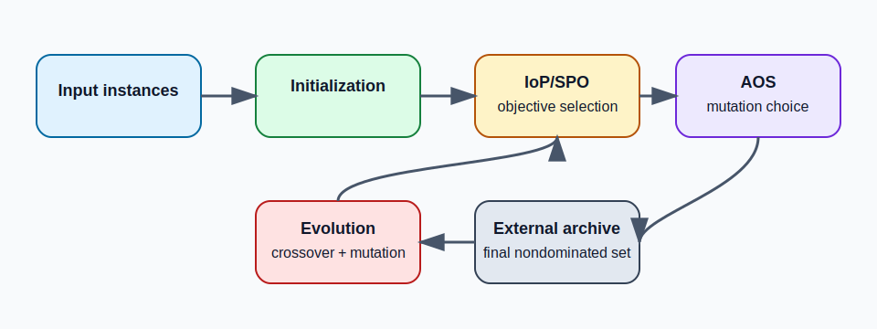

# D-NSGA2+ Experimental Code

> Public experimental code for **D-NSGA2+**, a diversity-enhanced multi-objective evolutionary algorithm for intercity ride-sharing routing.

[](LICENSE)
[](#installation)
[](#dataset-preparation)

## Overview

This repository contains the public experimental implementation of **D-NSGA2+** for a multi-objective intercity ride-sharing routing problem. The code implements the main mechanisms of the complete paper version, including IoP/SPO-based dynamic objective selection, adaptive operator selection, eight mutation operators, preprocessing, and an external archive.

The repository is intended for reproducing algorithmic runs and ablation settings together with the benchmark instances provided in the dataset branch.

## News / Updates

- `2026-06-14`: Public experiment-code release with reproducible configuration files and relative-path running instructions.
- `2026-06-14`: Added HV/IGD reference-setting notes and dataset placement instructions.

## Framework

<p align="center">
  
</p>

## Main Features

- **Dynamic objective selection**: IoP is computed at the beginning of each generation, SPO is obtained with softmax, and the active evolutionary objective is sampled from SPO.
- **Adaptive operator selection**: PM, AP, and MAB modes are supported; PM is the default experimental setting.
- **Eight mutation operators**: one enabled operator is selected by AOS for each mutation step; M1-M8 can be switched on or off for ablation studies.
- **Preprocessing switch**: `EXPERIMENT_ENABLE_PREPROCESSING` controls whether preprocessing is enabled. The preprocessing stage and the main evolutionary stage share the same mutation-operator switches.
- **External archive**: Pareto and epsilon-box archive update logic is retained. The task-level final result is produced by merging run-level EP outputs and applying nondominated filtering.
- **Reproducible configuration**: task range, run count, NOI, objective mode, AOS mode, random seed, and ablation switches are recorded in `ExperimentConfig.h` and written to `Result/run_config.txt` at runtime.

## Repository Structure

```text
.
|-- ExperimentConfig.h        # Experiment parameters, ablation switches, random seed settings
|-- NSGA2.cpp                 # Main workflow, IoP/SPO, output and run configuration
|-- Individual.cpp            # Initialization, mutation operators, AOS, archive update
|-- Population.cpp            # Population initialization and environmental selection
|-- data/                     # Notes for arranging runtime data files
|-- docs/                     # Reproducibility notes, parameter records, public assets
|-- examples/                 # Minimal example and sanity-check instructions
|-- Experimental instances/   # Dataset directories after merging with the dataset branch
|-- CITATION.cff              # Citation metadata
`-- LICENSE                   # Open-source license
```

## Installation

### 1. Clone the repository

```bash
git clone https://github.com/zhangjingwei290-hash/NSGA2-.git
cd NSGA2-
```

### 2. Install build tools

Required environment:

- Windows 10/11
- Visual Studio 2022/2026 or MSVC C++ Build Tools
- C++17 support

### 3. Build with MSVC

Compile in Visual Studio Developer PowerShell, or in a shell where `vcvars64.bat` has been loaded:

```powershell
cl /nologo /EHsc /std:c++17 /utf-8 /FeDNSGA2.exe NSGA2.cpp Individual.cpp Population.cpp pch.cpp
```

You may also create a Visual Studio C++ project and add the source files manually. Keeping `/utf-8` is recommended because the historical source code contains Chinese comments and legacy console output.

## Dataset Preparation

The repository contains the original benchmark directory `实验测试算例/` from the dataset branch and a unified runtime layout under `data/`. The C++ program uses the unified `data/` layout by default.

Tracked runtime layout:

```text
data/
|-- realworld_45/
|   |-- data/
|   |   |-- Mytxt.txt
|   |   `-- processed/
|   `-- time-distance-matrix/
|       |-- src-src-time/
|       |-- dest-dest-time/
|       |-- dest-src-time/
|       |-- src-dest-time/
|       |-- src-src-dis/
|       |-- dest-dest-dis/
|       |-- dest-src-dis/
|       `-- src-dest-dis/
`-- solomon_36/
    |-- data/
    |   |-- Mytxt.txt
    |   |-- c/
    |   |-- r/
    |   `-- rc/
    `-- time-distance-matrix/
```

The repository tracks the folder skeleton and the two task lists:

```text
data/realworld_45/data/Mytxt.txt
data/solomon_36/data/Mytxt.txt
```

Large CSV files are not duplicated under `data/`. Copy them from `实验测试算例/` into the matching folders before running. Detailed source-to-target migration steps are provided in [data/README.md](data/README.md).

Task-list formats:

```text
# Platform 45 format
stoptime max_delay data_file time1 time2 time3 time4 dist1 dist2 dist3 dist4

# Solomon 36 format
stoptime data_file time1 time2 time3 time4
```

For the 6-column Solomon format, `EXPERIMENT_DEFAULT_MAX_DELAY` is used and the four time matrices are reused as distance matrices, matching the historical Solomon setup.

## Quick Start

After building `DNSGA2.exe`, run it from the repository or benchmark working directory:

```powershell
.\DNSGA2.exe
```

The program locates `Mytxt.txt` from the unified dataset directory and writes results to `Result/` and `Stage/`.

For a small sanity-check setup, see [examples/README.md](examples/README.md).

## Configure Experiments

Main settings are centralized in `ExperimentConfig.h`:

- `EXPERIMENT_TASK_START` / `EXPERIMENT_TASK_END`: task range.
- `EXPERIMENT_RUN_COUNT`: independent runs per task. The paper-style default is 30.
- `EXPERIMENT_NOI_LIMIT`: inner iterations per generation. The paper-style default is 50.
- `EXPERIMENT_OBJECTIVE_MODE`: objective-selection mode. The complete mechanism uses `OBJECTIVE_IOP_SPO`.
- `EXPERIMENT_AOS_MODE`: AOS mode. The default is `AOS_PM`.
- `EXPERIMENT_ENABLE_PREPROCESSING`: preprocessing switch.
- `EXPERIMENT_MUTATION_OPERATOR_ENABLED`: M1-M8 mutation-operator switches.
- `EXPERIMENT_USE_FIXED_SEED` / `EXPERIMENT_BASE_SEED`: reproducible random-seed settings.

See [docs/EXPERIMENT_SETTINGS.md](docs/EXPERIMENT_SETTINGS.md) for the public hyperparameter record.

## Generated Results

After a run, outputs are written under the current working directory:

- `Result/task X result Y .txt`: output of task `X` in independent run `Y`. Each line contains the four objective values of one solution.
- `Result/task X final result.txt`: final nondominated set for task `X`, generated by merging the run-level EP outputs of the same task and applying nondominated filtering.
- `Result/run_config.txt`: actual configuration used in the run, including experiment switches and random-seed settings.
- `Stage/`: optional intermediate archive output for debugging or inspecting the evolutionary process.

`Result/` and `Stage/` are intentionally ignored by Git.

## Evaluation Protocol

the following evaluation settings are recommended:

- Treat all four objectives as minimization objectives.
- Compute metrics task by task; do not mix objective scales across different tasks.
- Deduplicate each run-level result and keep nondominated points before metric calculation.
- Use `[1.1, 1.1, 1.1, 1.1]` as the normalized HV reference point.
- For IGD, build the task-level reference front by merging normalized nondominated points from all methods and all runs included in the same comparison, then applying nondominated filtering again.

See [docs/REPRODUCIBILITY.md](docs/REPRODUCIBILITY.md) for the concise metric-setting record.


## Reproducibility Checklist

- Use relative paths in `Mytxt.txt`.
- Keep `Result/run_config.txt` with generated results.
- Keep task-level outputs separate when comparing methods.
- Record the benchmark group, dataset version, and preprocessing details with the generated results.
- Do not commit generated outputs to Git.


## Acknowledgements

We thank the maintainers of the benchmark datasets used in the experiments.

## License

This project is released under the MIT License. See [LICENSE](LICENSE).

## Known Limitations

- The source code inherits some historical console output; old encoding may still appear in the terminal. For formal experiments, rely on result files and `Result/run_config.txt` rather than console text.
- This repository provides experimental algorithm code and reproducibility instructions. Generated outputs are intentionally excluded from version control.
- If `ExperimentConfig.h` is modified for ablation studies, keep the corresponding `Result/run_config.txt` with the generated results.
